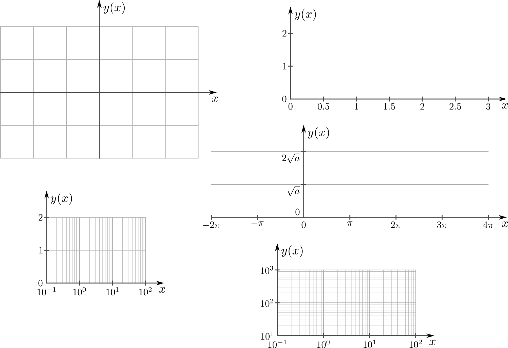
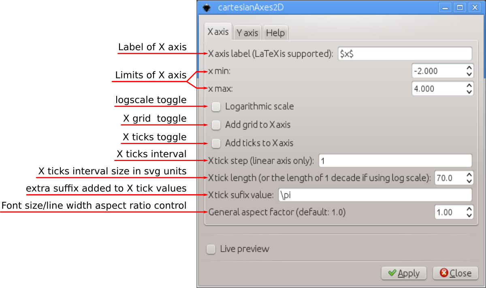
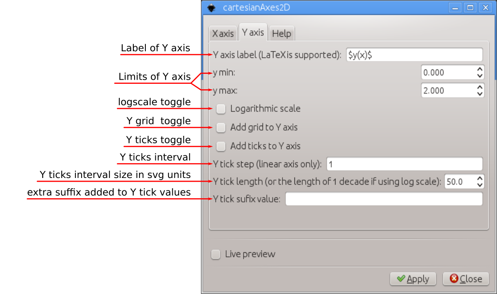

# cartesianAxes2D
Inkscape extension to assist creating 2D Cartesian axes




### main features

The main features are

 - linear and log10 scales
 - optional grid lines in X and Y directions
 - adjustable tick mark intervals and sizes
 - LaTeX support

# Installation and requirements

This extension was partially developed in Inkscape 0.48 and partially in 0.91 in Linux (Kubuntu 12.04 and 14.04). It should work on both versions of Inkscape. Also, they should work in different OSs too as long as all requirements are installed.

This extension requires another extension to run, inkscapeMadeEasy <https://github.com/fsmMLK/inkscapeMadeEasy>, which contains several backstage methods and classes.

In order to use cartesianAxes2D extension, you must also download inkscapeMadeEasy files and put them inside Inkscape's extension directory. Please refer to inkscapeMadeEasy installation instructions. In the end you must have the following files and directories in your Inkscape extension directory.

```
inkscape/extensions/
            |-- inkscapeMadeEasy_Base.py
            |-- inkscapeMadeEasy_Draw.py
            |-- inkscapeMadeEasy_Plot.py
            |-- textextLib
            |   |-- __init__.py
            |   |-- basicLatexPackages.tex
            |   |-- textext.inx
            |   |-- textext.py
            |
            |-- cartesianAxes2D.py
            `-- cartesianAxes2D.inx
```

**Disabling LaTeX support of inkscapeMadeEasy**

Many of the methods implemented in inkscapeMadeEasy project use LaTeX to generate text. To this end I decided to employ the excellent extension **textext** from Pauli Virtanen  <https://pav.iki.fi/software/textext/>. 

LaTeX support via textext extension requires LaTeX typesetting system in your computer (it's free and awesome! =] ), together with a few python modules (pygtk and Tkinter among others). The later might be a problem for non-Linux systems (precompiled inkscape for Windows as OS X don't come with them).

Since many people don't use LaTeX and/or don't have it installed, inkscapeMadeEasy's LaTeX support is now optional. **By default, LaTeX support is ENABLED.**

Please refer to <https://fsmmlk.github.io/inkscapeMadeEasy/#installation-and-requirements> on how to easily disable LaTeX support.

.. warning:: Since disabling LaTeX support is a new feature, this project was not yet extensively checked for misplacements/errors when this support is disabled. Please report any issues you find.

# Usage

The extension can be found under `extensions > fsmMLK > Plot 2D > Cartesian` menu.

This extension is presented in two tabs, **X axis** and  **Y axis**. They are used to configure independently the axes  of your chart. Both tabs have the same control elements, with the exception of the last control in the Xaxis tab, which controls the general aspect ratio of the Cartesian axes.






**X/Y axis label:** label of the axes. This string must be LaTeX compatible. Any LaTeX commands or environments are valid. If you want to write in mathematical environment, enclose your text with $...$. You don't have to escape any backslashes.

> Tip: Since `siunitx` package is included in basicLatexPackages.tex file by default in inkscapeMadeEasy, you can use any unit command available there 

Ex: `Foobar $\sqrt{x^2}$ so fancy! (\si{\newton\per\squaremetre})`


**X/Y min and max:** Set the limits of the axes. The extension will inform if these limits are invalid.
  
  - The upper limit must be greater than the lower limit
  - If logarithmic scale is checked, then the limits must be positive
  - If logarithmic scale is checked, then the lower limit will be rounded down to the nearest power of 10 and the upper rounded up to the nearest power of 10 in order to complete the decades. Ex: 0.2 to 12, then the limits will be rounded to 0.1 to 100

**Logarithmic scale:** Set the axis to be represented in log10 scale. In such case, the limits of the axis must be both greater than zero.

**Add grid to X/Y axis:** Draw grid lines in X or Y axes.
   - *linear scale:* The grid lines will be placed at each tick mark
   - *logarithmic scale:* The grid lines will be placed dividing each decade in 10 parts

**Add ticks to X/Y axis:** Draw tick marks with associated values in X or Y axes.

**X/Y tick step:** Tick marks interval  in units of your chart. This value is not referenced to  in logarithmic scale

Ex: limits from -1 to 1, with tick step of 0.5 will produce ticks at -1, -0.5, 0, 0.5, 1

> Note: The ticks will radiate from the origin x=0 or y=0 unless the origin does not lie within the limits. In such cases, the ticks will radiate starting from the  limit closest to the origin.
>
> Examples in x direction. The same rules apply to Y direction
>
> 


**X/Y tick length** The distance between the tick marks, in px.
   - *linear scale:* The distance between ticks in px.
   - *logarithmic scale:* The size of each decade in px.


**X/Y tick suffix value:** Optional extra suffix to be added to the tick values. You can use any LaTeX text/commands valid in mathematical environment $...$. You don't have to enclose your text between $...$. You don't have to escape any backslashes.


**General aspect factor:** (present in Xaxis tab only) General aspect ratio between line width and text width. I designed this extension to have an overall aspect ratio that looked nice to my eyes. It is a function of X and Y tick lengths. With this control you can scale both line widths and text height to fit your needs.


# Observations

 - The axes will be placed crossing the origin (0,0) or crossing the coordinate (x,y) closest to the origin if the origin does not lies within the limits.
 - The axes will be created at the center of your screen.

# Examples


